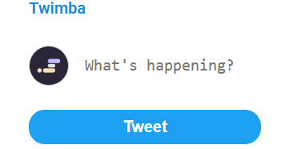

# Twimba

A Twitter-like web application that allows users to create tweets, like, retweet, and reply to posts.

[Live Demo](https://euphonious-unicorn-6f5fa2.netlify.app/)



## About

This project was created as part of The Frontend Developer Career Path at Scrimba. It replicates core Twitter functionality in a simplified interface.

## Features

- Create new tweets
- Like and unlike tweets
- Retweet and unretweet posts
- Reply to tweets
- View conversation threads
- Persistent state during session

## Technologies

- HTML
- CSS
- JavaScript (ES6+)
- JavaScript Modules
- UUID library for generating unique IDs
- Font Awesome for icons
- Google Fonts (Roboto)

## How it works

1. Write your tweet in the text area at the top of the page
2. Click the "Tweet" button to post
3. Interact with existing tweets:
   - Click the heart icon to like/unlike
   - Click the retweet icon to retweet/unretweet
   - Click the comment icon to open the reply section
   - Type your reply and click "Reply" to join the conversation

## Project Structure

```
twimba/
├── images/
│   ├── scrimbalogo.png
│   ├── troll.jpg
│   ├── musk.png
│   └── ... (other profile images)
├── index.html
├── index.css
├── index.js
├── data.js
└── README.md
```

## Running the project

Clone the repository and open `index.html` in your browser:

```bash
git clone https://github.com/phattp/twimba.git
cd twimba
```

## What I learned

- Working with JavaScript modules (import/export)
- Using event delegation for efficient event handling
- Manipulating data and updating the UI
- Implementing toggle functionality (like, retweet, show/hide replies)
- Dynamic HTML rendering based on data
- Using UUID to generate unique identifiers
- Creating an interactive user interface

---

Created by [Phatthara Pisootrapee](https://github.com/phattp) | [The Frontend Developer Career Path at Scrimba](https://scrimba.com/learn/frontend)
